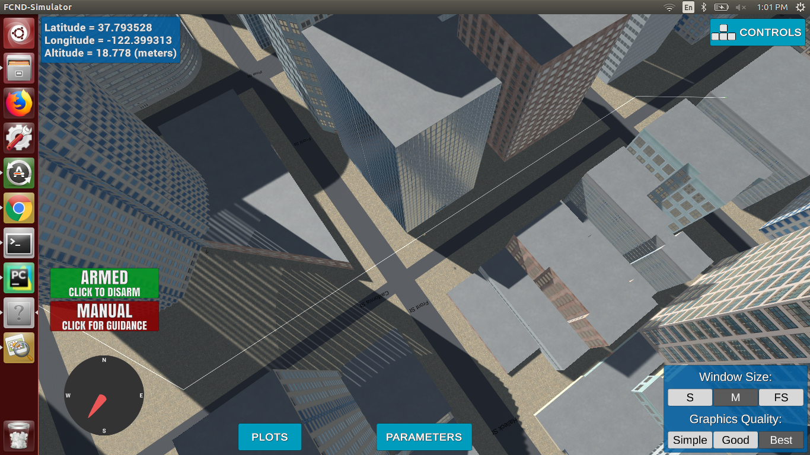
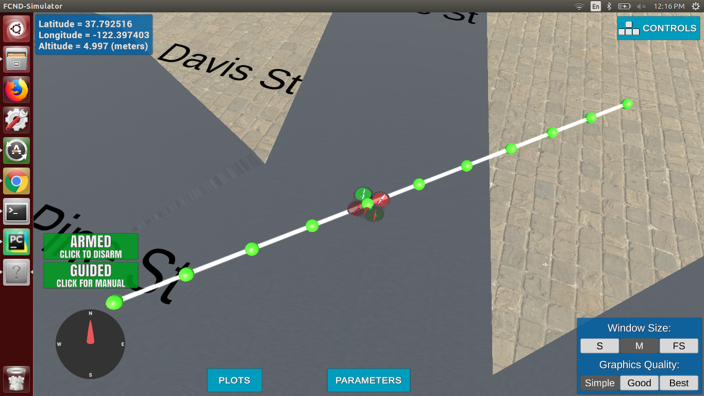
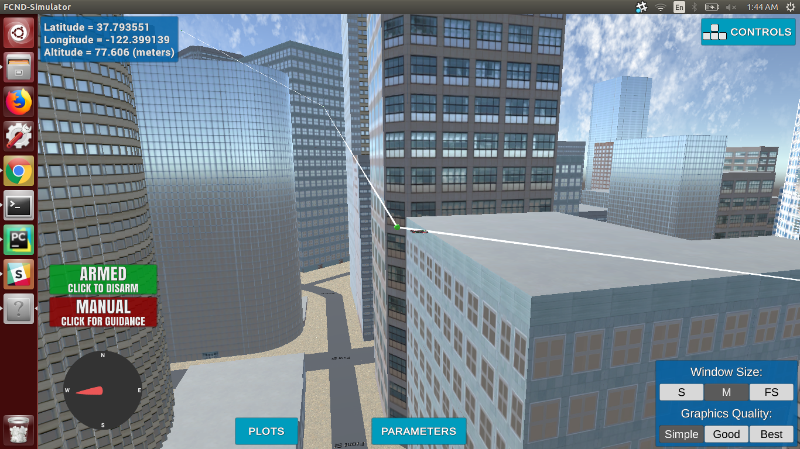
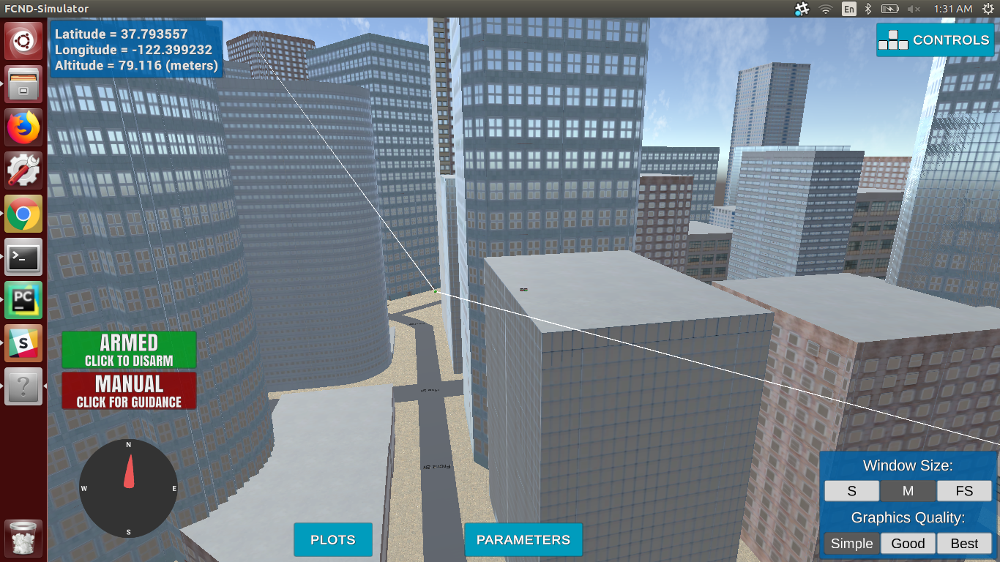

## Project: 3D Motion Planning

---
### Writeup

Below I describe how I addressed each rubric point and where in my code each point is handled.

### Explain the Starter Code

#### 1. Explain the functionality of what's provided in `motion_planning.py` and `planning_utils.py`
The starter code in motion_planning.py is planning a path from (N=0, E=0) to (N=10, E=10) at 
an altitude equal to TARGET_ALTITUDE. These locations are relative to the global home position.
The A* algorithm implemented does not include diagonal actions which result in the planned path to be zig-zag.
 

And here's how the path looks like when diagonal actions are added to
the action space.

### Implementing Path Planning Algorithm

#### 1. Set your global home position
Used Python open() function to open the 'colliders.csv' file. Read the first line containing longitude and latitude using the CSV module. 
Split the string and data using the split method and converted the data values 
back to float. Then set the global home position using set_home_position() 
method to the values just read.   

#### 2. Set your current local position
Used global_to_local() method of Drone class to convert the current global position 
of the drone to the local NED location relative to the global home position set in the 
previous step.

#### 3. Set grid start position from local position
I got the current local position of drone in NED frame in the last step. Used 
that location as the start position. But before using the same position in the 
grid I needed to shift the points according to the grid offsets.

#### 4. Set grid goal position from geodetic coords
Changed the init() function a bit to be able to pass the desired goal location 
to MotionPlanning class. Sets the new attribute global_goal to the goal location 
passed by the user. Used this global_goal to set the goal on the grid by 
applying the same shift as with start location.

#### 5. A* implementation
In here, I chose to use the Voronoi graph instead of a grid as they provide a much safer path to follow. 
So updated the A* to work with the graphs that expand to the connected nodes. 
I also changed the A* implementation a little bit so that nodes are only visited if we 
have found the shortest path to that node and added a condition to replace the old 
path with the new one if the new path is less expensive.

#### 6. Cull waypoints 
I implemented this step in two phases.

#####Phase 1:
To prune the 2D path I implemented the Bresenham algorithm that works with no 
condition on points p1, p2. This removes a significant amount of redundant 
waypoints.\
But after pruning the path I got by running A* on the Voronoi graph was 2D. So 
to get a 3D path I calculated the difference between the altitude of start and 
goal location. And given the number of waypoints, I found the increment/decrement 
needed in the altitude for each consecutive waypoints.
#####Phase 2:
The waypoints that were removed in the first phase was considering them to be 
in one plane. Now, as the path is 3D I can get some more improvement. 
To do this I extracted the 2.5D map by using polygon representation of 
obstacles and used ray tracing to find out if two points in 3D can be connected. 
Iterate through the nodes got after pruning the path using the Bresenham algorithm 
and further removed the redundant nodes in 3D.

See the difference in the image below. The path in the second image was 
otherwise not possible because of the obstacle (building) below it.

### Execute the flight
#### 1. Does it work?
The path planner works in 3D and can be used to find a 
the path from start to goal located at different altitudes.